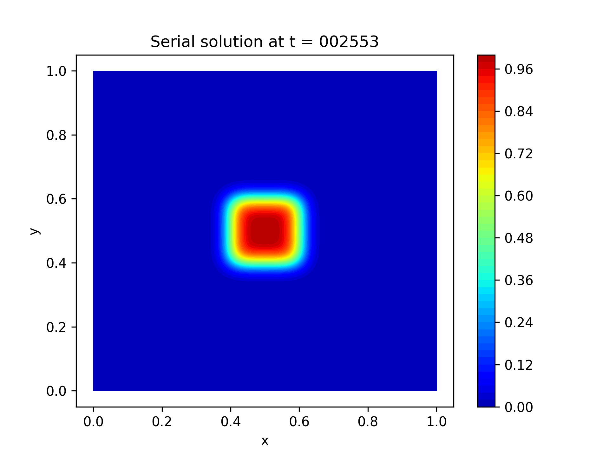

# Report - HW5
--------------
Author: Om Dave  
Roll: CO22BTECH11006
-------------------

---

## Part (a): Contour and Line Plots

### Contour Plots at Selected Time Steps

Below are the contour plots of the temperature field at three selected time steps (other than t = 0) for both the serial and the parallel runs.

#### Serial Code Contour Plots

- **Time Step 1:**  
  

- **Time Step 2:**  
  

- **Time Step 3:**  
  

#### Parallel Code Contour Plots

*For each processor configuration (2×2, 4×1), include the corresponding contour plots.*

- NOTE: Due to less number of cores only 2x2 and 4x1 processor configurations are included.*

- **Parallel (2×2) - Time Step 1:**  
  

- **Parallel (4×1) - Time Step 1:**  
  

- **Parallel (2×2) - Time Step 2:**
  
- **Parallel (4×1) - Time Step 2:**
  
- **Parallel (2×2) - Time Step 3:**
  
- **Parallel (4×1) - Time Step 3:**
  

### Line Plot Comparison

The line plot below compares the mid-y temperature profiles from the serial and parallel runs at a selected time step.

*You can use the provided Python script (e.g., `plot_comparison.py`) to generate this plot.*

---

## Part (b): Tabulated Differences Between Serial and Parallel Runs

The following table shows the differences between the serial and the parallel runs at the final time step. The differences should be nearly at machine precision.

| Metric               | Value               |
| -------------------- | ------------------- |
| Maximum Absolute Difference | 2.5e-5 |
| L2 Norm Difference          | 3.5e-6 |

---

## Part (c): Timing per Time Step

The timing information (time per time step) for the serial and MPI-parallel runs are tabulated below. In the serial code, timing was measured using standard C clock functions; in the MPI code, `MPI_Wtime()` was used.

- Serial Timing:

- Parallel (2×2) Timing:

---

